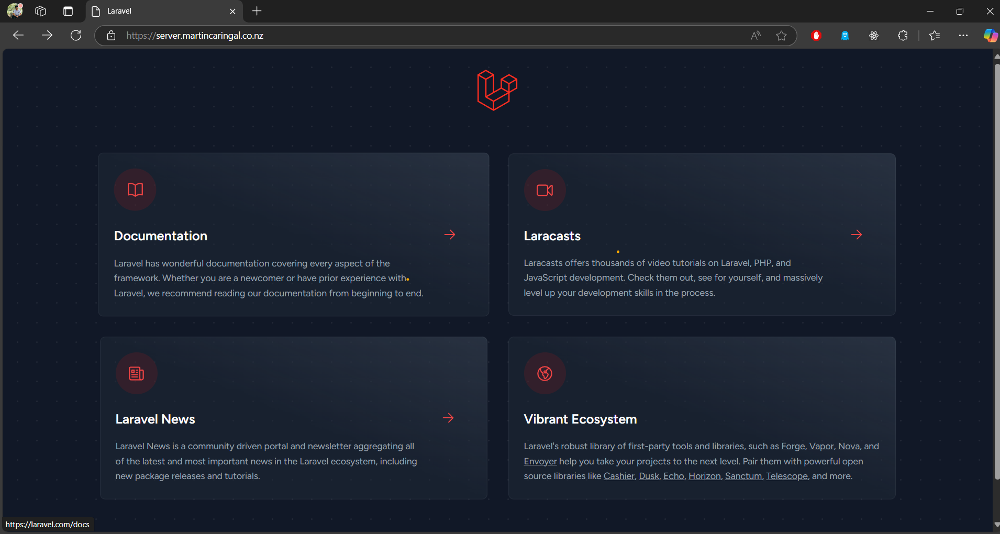

# AWS Backend Infrastructure for Student Enrollment System

This repository contains the Terraform infrastructure code for deploying a highly available, scalable Laravel application on AWS ECS Fargate.

Related Repositories:

- Frontend Web Application: [CaringalML/Student-Enrollment-System-React](https://github.com/CaringalML/Student-Enrollment-System-React)
- Backend Web Application: [CaringalML/Student-Enrollment-System-Laravel-API](https://github.com/CaringalML/Student-Enrollment-System-Laravel-API)


## Table of Contents
- [Architecture Overview](#architecture-overview)
- [Prerequisites](#prerequisites)
- [Repository Structure](#repository-structure)
- [Deployment Instructions](#deployment-instructions)
- [Infrastructure Components](#infrastructure-components)
- [Access and Security](#access-and-security)
- [Auto Scaling](#auto-scaling)
- [Monitoring and Logging](#monitoring-and-logging)
- [Cost Optimization](#cost-optimization)
- [AWS Infrastructure Cost Estimation](#aws-infrastructure-cost-estimation)
  - [Compute Services](#compute-services)
  - [Database Services](#database-services)
  - [Network Services](#network-services)
  - [Storage & Registry](#storage--registry)
  - [Additional Services](#additional-services)
  - [Total Monthly Cost Breakdown](#total-monthly-cost-breakdown)
  - [Cost Optimization Opportunities](#cost-optimization-opportunities)
- [Disaster Recovery](#disaster-recovery)
- [Maintenance](#maintenance)
- [Troubleshooting](#troubleshooting)
- [Best Practices](#best-practices)
- [Performance Optimization](#performance-optimization)
- [Contributing](#contributing)
- [Deployment Results](#deployment-results)
- [License](#license)

## Architecture Overview

### Networking Layer
- **VPC Configuration**:
  - CIDR block: 192.168.0.0/24
  - Region: ap-southeast-2 (Sydney)
  - Availability Zones: ap-southeast-2a, ap-southeast-2b
  
- **Subnet Layout**:
  - Public Subnet 1: 192.168.0.0/26 (ap-southeast-2a)
  - Public Subnet 2: 192.168.0.64/26 (ap-southeast-2b)
  - Private Subnet 1: 192.168.0.128/26 (ap-southeast-2a)
  - Private Subnet 2: 192.168.0.192/26 (ap-southeast-2b)

- **Network Components**:
  - NAT Gateway in Public Subnet
  - Internet Gateway for public access
  - S3 VPC Endpoint for optimized access
  - Route tables for public and private subnets

### Compute Layer
- **ECS Cluster Configuration**:
  - Cluster Name: laravel-node
  - Capacity Providers: FARGATE and FARGATE_SPOT
  - Container Insights enabled

- **ECS Service Settings**:
  - Service Name: student-enrollment-service
  - Desired Count: 2 (minimum)
  - Maximum Count: 20
  - Platform Version: LATEST
  - Deployment Circuit Breaker enabled
  - Rolling updates with force new deployment

- **Task Definition Specifications**:
  - CPU: 1024 (1 vCPU)
  - Memory: 2048 MB (2GB)
  - Operating System: Linux
  - Architecture: X86_64

### Database Layer
- **RDS Configuration**:
  - Engine: MySQL 8.0.35
  - Instance Class: db.t3.micro
  - Storage: 20GB gp2
  - Backup Retention: 7 days
  - Maintenance Window: Monday 04:00-05:00
  - Backup Window: 03:00-04:00

### Application Load Balancer
- **ALB Configuration**:
  - Scheme: internet-facing
  - IP Address Type: ipv4
  - HTTP/2 Enabled
  - Access Logs Enabled

- **Listener Configuration**:
  - HTTP (Port 80) with redirect to HTTPS
  - HTTPS (Port 443) with SSL/TLS certificate
  - SSL Policy: ELBSecurityPolicy-TLS-1-2-2017-01

### Container Registry
- **ECR Repository**:
  - Image Tag Mutability: Mutable
  - Image Scanning: Enabled on push
  - Encryption: AES-256
  - Lifecycle Policy: Keep last 30 images


  ### Infrastructure Diagram


## Prerequisites

### AWS Account Requirements
- IAM user with administrative privileges
- Access Key and Secret Access Key
- Quota limits checked for:
  - VPCs
  - ECS Services
  - RDS Instances
  - NAT Gateways
  - Elastic IPs

### Local Development Setup
- AWS CLI version 2.0 or later
- Terraform v1.0.0 or later
- Docker version 20.10 or later
- Git

### Domain Requirements
- Registered domain in Route 53
- Ability to modify DNS records
- SSL/TLS certificate requirements understood

## Repository Structure

```
.
├── acm.tf                    # ACM certificate configuration
│   ├── Certificate creation
│   ├── DNS validation
│   └── Alternative names
├── alb.tf                    # Application Load Balancer configuration
│   ├── ALB creation
│   ├── Target group
│   ├── Listeners
│   └── Rules
├── cloudwatch.tf             # CloudWatch logs and metrics
│   ├── Log groups
│   └── Retention policies
├── cluster.tf                # ECS cluster configuration
│   ├── Cluster creation
│   ├── Capacity providers
│   └── Container insights
├── ecr.tf                    # ECR repository configuration
│   ├── Repository creation
│   ├── Lifecycle policies
│   └── Scanning configuration
├── ecs-fargate-service.tf    # ECS service and auto-scaling
│   ├── Service definition
│   ├── Auto-scaling targets
│   └── Scaling policies
├── ecs-update-service.tf     # Service update automation
│   ├── EventBridge rules
│   ├── Lambda function
│   └── IAM roles
├── iam.tf                    # IAM roles and policies
│   ├── Execution roles
│   ├── Task roles
│   └── Policy documents
├── lambda/                   # Lambda function code
│   └── update-ecs-service.py
├── outputs.tf                # Terraform outputs
├── rds-mysql.tf             # RDS instance configuration
│   ├── Instance creation
│   ├── Subnet groups
│   └── Parameter groups
├── route-53-dns-record.tf    # DNS configuration
├── secrets.tf                # Secrets Manager configuration
├── security-group.tf         # Security group definitions
├── task-definition.tf        # ECS task definition
├── terraform.tfvars          # Variable values
├── variables.tf              # Variable declarations
└── vpc.tf                    # VPC and networking
```

## Deployment Instructions

### ⚠️ Important Reminder
If the ECR repository is already created, you should immediately push your Docker image to prevent deployment issues. ECS tasks will fail to start if they cannot pull the specified image.

```bash

#Configure AWS credentials
aws configure

# Check if the repository exists
aws ecr describe-repositories --repository-names student-enrollment-laravel-api

# Authenticate with ECR
aws ecr get-login-password --region <region> | docker login --username AWS --password-stdin <account_id>.dkr.ecr.<region>.amazonaws.com

# Build and push the image
docker build -t student-enrollment-laravel-api:latest --no-cache .
docker tag student-enrollment-laravel-api:latest <account_id>.dkr.ecr.<region>.amazonaws.com/student-enrollment-laravel-api:latest
docker push <account_id>.dkr.ecr.<region>.amazonaws.com/student-enrollment-laravel-api:latest
```

### Initial Setup
1. Clone the repository:
```bash
git clone https://github.com/CaringalML/AWS-Laravel-RESTful-API-Backend-Infrastructure.git
cd https://github.com/CaringalML/AWS-Laravel-RESTful-API-Backend-Infrastructure.git
```

2. Configure AWS credentials:
```bash
aws configure
```

3. Initialize Terraform:
```bash
terraform init
```

### Configuration
1. Create a `terraform.tfvars` file:
```hcl
aws_region = "ap-southeast-2"
environment = "production"
project_name = "student-enrollment"
# Add other required variables
```

2. Review and modify variables in `variables.tf` as needed

### Infrastructure Deployment
1. Format and validate Terraform code:
```bash
terraform fmt
terraform validate
```

2. Review the infrastructure plan:
```bash
terraform plan  
```

3. Apply the infrastructure:
```bash
terraform apply 
```

## CI/CD Pipeline

### GitHub Actions Workflow

The repository includes a GitHub Actions workflow that automates the Docker image build and push process to Amazon ECR. This significantly speeds up the deployment process and ensures consistency.

```yaml
name: Docker Image CI

on:
  push:
    branches: [ "main" ]
  pull_request:
    branches: [ "main" ]

jobs:
  build:
    runs-on: ubuntu-latest

    steps:
      - uses: actions/checkout@v4

      - name: Set up PHP
        uses: shivammathur/setup-php@v2
        with:
          php-version: '8.2'

      - name: Clear Composer Cache
        run: composer clear-cache
        
      - name: Install Dependencies
        run: |
           composer install --prefer-dist --no-dev --no-interaction --no-progress --optimize-autoloader

      - name: Configure AWS credentials
        uses: aws-actions/configure-aws-credentials@v1
        with:
          aws-access-key-id: ${{ secrets.AWS_ACCESS_KEY_ID }}
          aws-secret-access-key: ${{ secrets.AWS_SECRET_ACCESS_KEY }}
          aws-region: ap-southeast-2

      - name: Login to Amazon ECR
        id: login-ecr
        run: |
          aws ecr get-login-password --region ap-southeast-2 | docker login --username AWS --password-stdin 939737198590.dkr.ecr.ap-southeast-2.amazonaws.com

      - name: Build and push Docker image
        run: |
          docker build -t student-enrollment-laravel-api:latest --no-cache .
          docker tag student-enrollment-laravel-api:latest <account_id>.dkr.ecr.<region>.amazonaws.com/student-enrollment-laravel-api:latest
          docker push <account_id>.dkr.ecr.<region>.amazonaws.com/student-enrollment-laravel-api:latest
```

### CI/CD Prerequisites

1. **GitHub Secrets Configuration**
   - `AWS_ACCESS_KEY_ID`: Your AWS access key
   - `AWS_SECRET_ACCESS_KEY`: Your AWS secret key

2. **AWS ECR Repository**
   - Ensure the ECR repository exists before the first workflow run
   - Verify IAM permissions for pushing images

### Automated Process

The workflow automatically:
1. Sets up PHP 8.2 environment
2. Installs project dependencies
3. Configures AWS credentials
4. Logs in to Amazon ECR
5. Builds and pushes the Docker image

This automation replaces the manual Docker build and push process described in the Deployment Instructions section, saving time and reducing potential errors.


## Access and Security

### Domain and SSL
- The application is accessible at `server.martincaringal.co.nz`
- SSL/TLS certificate is automatically provisioned and renewed through ACM
- HTTP traffic is automatically redirected to HTTPS

### Database Access
- RDS instance is only accessible from ECS tasks
- Database credentials are stored in Secrets Manager
- Regular automated backups are configured

### Application Security
- All sensitive environment variables are stored in Secrets Manager
- Security groups are configured for minimum required access
- Private subnets are used for ECS tasks and RDS

## Infrastructure Components

### Security Groups
1. **ALB Security Group**:
   - Inbound: 80, 443 from anywhere
   - Outbound: All traffic

2. **ECS Tasks Security Group**:
   - Inbound: 80 from ALB
   - Outbound: All traffic

3. **RDS Security Group**:
   - Inbound: 3306 from ECS Tasks
   - Outbound: All traffic

### IAM Roles and Policies
1. **ECS Task Execution Role**:
   - ECR access
   - CloudWatch Logs access
   - Secrets Manager access

2. **ECS Task Role**:
   - Application-specific permissions
   - S3 access
   - Systems Manager access

3. **Lambda Execution Role**:
   - ECS service update permissions
   - CloudWatch Logs access

### Auto-Scaling Policies

#### CPU Based Scaling
```hcl
resource "aws_appautoscaling_policy" "cpu" {
  name               = "cpu-auto-scaling"
  policy_type        = "TargetTrackingScaling"
  target_value       = 70
  scale_in_cooldown  = 300
  scale_out_cooldown = 60
}
```

#### Memory Based Scaling
```hcl
resource "aws_appautoscaling_policy" "memory" {
  name               = "memory-auto-scaling"
  policy_type        = "TargetTrackingScaling"
  target_value       = 80
  scale_in_cooldown  = 300
  scale_out_cooldown = 60
}
```

## Monitoring and Logging

### CloudWatch Integration
- Container Insights enabled for ECS cluster
- Application logs stored in CloudWatch Log Groups
- Custom metrics for application monitoring
- Automated alerts for critical events

### Log Groups
1. **Application Logs**:
   - Group: `/ecs/student-enrollment-laravel-api`
   - Retention: 30 days

2. **ECS Cluster Logs**:
   - Group: `/ecs/laravel-node`
   - Container Insights metrics

### Metrics and Alarms
- CPU and Memory utilization
- Request count and latency
- Error rates and 5xx responses
- Database connections and performance

## Cost Optimization

### Resource Optimization
- Use of FARGATE_SPOT for cost savings
- Auto-scaling based on demand
- S3 VPC Endpoint for reduced data transfer costs

### Monitoring and Control
- Cost allocation tags
- Budget alerts
- Resource utilization tracking

## Disaster Recovery

### Backup Strategy
- RDS automated backups (7-day retention)
- Final snapshot on deletion
- Infrastructure as Code for quick recovery

### Recovery Procedures
1. Database Recovery:
   - Restore from latest backup
   - Point-in-time recovery available
   
2. Application Recovery:
   - Deploy from latest ECR image
   - Restore configurations from Secrets Manager


### Application Updates
1. Build and push new Docker image
2. Automated deployment via ECS
3. Rolling updates with zero downtime

## Troubleshooting

### Common Issues and Solutions

1. **ECS Service Not Stable**
   - Check ECS service events
   - Verify task definition
   - Check container logs
   - Validate security group rules

2. **RDS Connectivity Issues**
   - Verify security group rules
   - Check subnet routing
   - Validate credentials in Secrets Manager
   - Review VPC endpoints

3. **ALB Health Check Failures**
   - Verify target group settings
   - Check application health endpoint
   - Review security group rules
   - Inspect container logs

## Best Practices

### Security Best Practices
1. **Network Security**:
   - Use private subnets for sensitive components
   - Implement network ACLs
   - Enable VPC Flow Logs

2. **Data Security**:
   - Encrypt data at rest
   - Use Secrets Manager for credentials
   - Implement least privilege access

### Operational Best Practices
1. **Monitoring**:
   - Set up CloudWatch alarms
   - Configure metric filters
   - Implement log analysis

2. **Backup Strategy**:
   - Regular RDS snapshots
   - S3 bucket versioning
   - Disaster recovery testing


## Infrastructure Variables

### Required Variables
| Variable Name | Description | Type | Default | Required |
|--------------|-------------|------|---------|-----------|
| `aws_region` | AWS region where resources will be created | `string` | `"ap-southeast-2"` | yes |
| `environment` | Environment (e.g., production, staging) | `string` | n/a | yes |
| `project_name` | Name of the project | `string` | n/a | yes |
| `app_key` | Laravel application key | `string` | n/a | yes |
| `db_password` | Database password | `string` | n/a | yes |
| `aws_access_key_id` | AWS access key ID | `string` | n/a | yes |
| `aws_secret_access_key` | AWS secret access key | `string` | n/a | yes |

### Application Variables
| Variable Name | Description | Type | Default | Required |
|--------------|-------------|------|---------|-----------|
| `app_name` | Laravel application name | `string` | `"Laravel"` | no |
| `app_url` | Laravel application URL | `string` | `"http://127.0.0.1:8000"` | no |
| `app_debug` | Laravel debug mode | `string` | `"false"` | no |
| `log_channel` | Laravel log channel | `string` | `"stack"` | no |
| `log_level` | Laravel log level | `string` | `"debug"` | no |

### Database Variables
| Variable Name | Description | Type | Default | Required |
|--------------|-------------|------|---------|-----------|
| `db_connection` | Database connection type | `string` | `"mysql"` | no |
| `db_port` | Database port | `number` | `3306` | no |
| `db_name` | Database name | `string` | `"collage"` | no |
| `db_username` | Database username | `string` | `"admin"` | no |

### Container Configuration
| Variable Name | Description | Type | Default | Required |
|--------------|-------------|------|---------|-----------|
| `container_cpu` | CPU units for the container (1024 = 1 vCPU) | `number` | `1024` | no |
| `container_memory` | Memory for the container in MiB | `number` | `2048` | no |
| `container_port` | Port exposed by the container | `number` | `80` | no |

### ECR Configuration
| Variable Name | Description | Type | Default | Required |
|--------------|-------------|------|---------|-----------|
| `repository_name` | Name of the ECR repository | `string` | n/a | yes |
| `image_tag_mutability` | The tag mutability setting for the repository | `string` | `"MUTABLE"` | no |
| `scan_on_push` | Indicates whether images are scanned after being pushed | `bool` | `true` | no |
| `max_image_count` | Maximum number of images to keep in the repository | `number` | `30` | no |

### Cache and Session Configuration
| Variable Name | Description | Type | Default | Required |
|--------------|-------------|------|---------|-----------|
| `redis_host` | Redis host | `string` | `"127.0.0.1"` | no |
| `redis_port` | Redis port | `string` | `"6379"` | no |
| `session_driver` | Laravel session driver | `string` | `"file"` | no |
| `cache_driver` | Laravel cache driver | `string` | `"file"` | no |

### Mail Configuration
| Variable Name | Description | Type | Default | Required |
|--------------|-------------|------|---------|-----------|
| `mail_mailer` | Laravel mail mailer | `string` | `"smtp"` | no |
| `mail_host` | Laravel mail host | `string` | `"mailpit"` | no |
| `mail_port` | Laravel mail port | `string` | `"1025"` | no |
| `mail_username` | Laravel mail username | `string` | `"null"` | no |
| `mail_encryption` | Laravel mail encryption | `string` | `"null"` | no |

### Tags
| Variable Name | Description | Type | Default | Required |
|--------------|-------------|------|---------|-----------|
| `default_tags` | Default tags to apply to all resources | `map(string)` | See below | yes |

Default tags structure:
```hcl
default_tags = {
  Name        = "student-enrollment-laravel-api"
  Environment = "production"
  Project     = "student-enrollment"
  Managed_by  = "terraform"
}
```

## Contributing

### Development Workflow
1. Fork the repository
2. Create a feature branch
3. Follow coding standards
4. Write tests
5. Submit pull request

### Code Standards
1. **Terraform**:
   - Use consistent formatting
   - Follow naming conventions
   - Document all resources

2. **Infrastructure**:
   - Maintain high availability
   - Implement security best practices
   - Consider cost optimization

## Support

For support and questions, please:
1. Check existing issues
2. Create a new issue with details
3. Follow the issue template
4. Provide relevant logs and configurations


## Regular Maintenance

### Daily Checks
1. **Monitor Health**
   - Check ECS service status in AWS Console
   - Review any CloudWatch alarms
   - Check RDS status
   - Monitor application error logs

2. **Security**
   - Review any security alerts
   - Check for failed login attempts
   - Monitor unusual traffic patterns

### Weekly Tasks
1. **Performance**
   - Review CloudWatch metrics
   - Check container resource usage
   - Monitor database performance

2. **Backups**
   - Verify RDS backups completed
   - Check ECR image backups
   - Test a backup if needed

3. **Costs**
   - Review AWS costs
   - Check for unused resources
   - Monitor resource usage

### Monthly Tasks
1. **Updates**
   - Update Terraform if needed
   - Check for AWS service updates
   - Review and update documentation

2. **Security**
   - Rotate credentials if needed
   - Review security groups
   - Check SSL certificates

3. **Database**
   - Check storage usage
   - Review slow queries
   - Optimize if needed


## Deployment Results

The following screenshots demonstrate the successful deployment of the infrastructure:

#### AWS Console Views

1. **ECS Cluster Overview**
   
   
   - Shows the running ECS cluster with healthy tasks
   - Demonstrates successful container deployments

2. **Application Load Balancer**
   
   
   - Displays the ALB configuration
   - Shows healthy target groups

3. **RDS Database Instance**
   
   - Shows the running RDS instance
   - Indicates successful database deployment

#### Application Access

4. **API Endpoint Access**
   
   
   
   
   - Accessible at: `https://server.martincaringal.co.nz`
   - Shows successful SSL/TLS configuration
   - Demonstrates API health check response

6. **CloudWatch Monitoring**
   
   
   - Shows real-time monitoring metrics
   - Demonstrates successful logging integration


# AWS Infrastructure Cost Estimation

**Cost Analysis Details:**
- Generated by: AWS Pricing Calculator
- Date: December 7, 2024
- Region: ap-southeast-2 (Sydney)
- Currency: All prices in USD

## Compute Services

### ECS Fargate
- Configuration: 1 vCPU (1024 CPU units), 2GB memory
- Base: 2 tasks (minimum)
- Current Pricing:
  - Per vCPU: $0.04865/hour
  - Per GB memory: $0.00532/hour
- Monthly Cost per Task:
  - vCPU: $0.04865 × 24 × 30.44 = $35.54
  - Memory: $0.00532 × 2GB × 24 × 30.44 = $7.77
- Base Monthly Cost (2 tasks): $86.62

### Lambda Function (ECS Updates)
- Free tier eligible
- Estimated executions: 100/month
- Estimated cost: < $0.20/month

## Database Services

### RDS MySQL (db.t3.micro)
- Instance cost: $0.019/hour
- Storage: 20GB GP2 ($0.127/GB-month)
- Backup storage: 7 days retention
- Monthly cost:
  - Instance: $0.019 × 24 × 30.44 = $13.87
  - Storage: $0.127 × 20 = $2.54
- Total RDS Cost: $16.41/month

## Network Services

### Application Load Balancer
- Base cost: $0.02437/hour
- Monthly ALB cost: $0.02437 × 24 × 30.44 = $17.80
- LCU cost varies with usage

### NAT Gateway
- Hourly cost: $0.048/hour
- Monthly base cost: $0.048 × 24 × 30.44 = $35.07
- Data processing: $0.048/GB

### Data Transfer
- Internet to ALB: $0.092/GB after first 1GB
- Estimated cost (50GB/month): $4.60

## Storage & Registry

### ECR Repository
- Storage: $0.11/GB-month
- Data transfer: First 1GB free
- Estimated monthly cost (5GB): $0.55

### CloudWatch Logs
- Ingestion: $0.76/GB
- Storage: $0.033/GB-month
- Container Insights enabled
- Estimated monthly cost: $8.00

## Additional Services

### Route 53
- Hosted zone: $0.54/month
- DNS queries: $0.45/month per million queries
- Estimated monthly cost: $1.00

### Secrets Manager
- 8 secrets configured
- $0.44/secret/month
- Monthly cost: $3.52

### ACM Certificate
- Public certificate: Free

## Total Monthly Cost Breakdown

### Base Infrastructure (Minimum Usage)
1. Compute (Fargate + Lambda): $86.82
2. Database (RDS): $16.41
3. Network (ALB + NAT): $52.87
4. Storage & Monitoring: $8.55
5. Additional Services: $4.52

**Total Base Monthly Cost: $169.17**

### Variable Costs (Additional)
1. Data Transfer: $0.092/GB (after 1GB)
2. NAT Gateway Data Processing: $0.048/GB
3. CloudWatch Logs ingestion: $0.76/GB
4. Auto-scaling (up to 20 tasks): $43.31/additional task

### Cost Optimization Opportunities

1. **Compute Savings**
   - Using FARGATE_SPOT (up to 70% savings)
   - Current config: 3:1 SPOT weight
   - Potential monthly savings: Up to $30

2. **NAT Gateway Optimization**
   - Using S3 VPC Endpoint (already implemented)
   - Monitoring data transfer patterns
   - Potential savings: $5-10/month

3. **Database Optimization**
   - Monitor T3 burst credits
   - Consider reserved instance for 1-year term
   - Potential savings: Up to 20%

4. **Storage Optimization**
   - Implement log filtering
   - Optimize ECR image retention
   - Potential savings: $2-3/month

## Important Notes

1. Prices are from AWS Calculator as of December 2024
2. All costs are in USD
3. Excludes free tier benefits
4. Auto-scaling may significantly impact costs
5. Data transfer costs vary with usage
6. Actual costs may be lower with free tier

## Monitoring Recommendations

1. Set up AWS Cost Explorer
2. Create budget alerts at:
   - 80% of expected spend ($135)
   - 100% of expected spend ($169)
3. Monitor auto-scaling events
4. Track NAT Gateway usage

Contact AWS support for more detailed pricing information or customized cost optimization recommendations.


### Emergency Procedures

1. **Service Issues**
   - Check ECS service logs
   - Review recent changes
   - Rollback if needed
   - Document the incident

2. **Database Issues**
   - Check RDS metrics
   - Review error logs
   - Restore from backup if needed
   - Contact AWS support if required

### Maintenance Contacts

- AWS Support: https://support.aws.amazon.com

For support and assistance:
- Technical Issues: lawrencecaringal5@gmail.com
- Infrastructure Support: [GitHub Issues](https://github.com/CaringalML/AWS-Laravel-Backend-Infrastructure-Terraform/issues)


